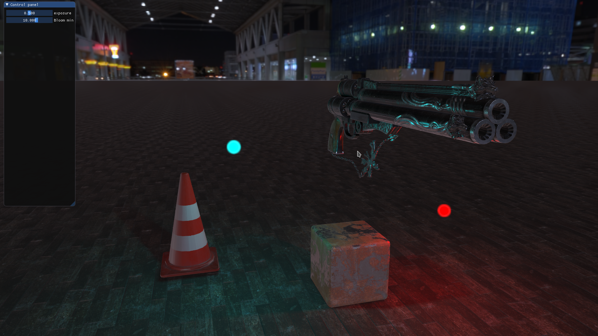

# 3D engine
---------------
C++ / openGL 3D deffered render engine currently in development.  

## Gallery:
  

#### Right now it supports following features:  
* Physically Based Rendering  
* Image Based Lighting (roughness/metallness workflow)  
* Normal mapping  
* Parallax occlusion mapping  
* Custom skyboxes  
* Gamma correction  
* HDR (with exposure)  
* Bloom  
* Dynamic shadow mapping  
* Face culling  
* Different types of light casters  
* Multiple cameras  
* Basic mesh loading
* Integrated open GUI library - dear ImGui

#### Coming soon:
* Better texture filtering (right now its very blurry)
* Smooth shading support
* Some post-process antialiasing
* Screen Space Ambient Occlusion  
* Screen Space Reflections  
* Complex model loading support  
* Particles

#### Coming not so soon:  
* Skeletal animations  

## Building:
Right now project runs only on linux, but all libraries are platform independent,  
so it shouldn't be a problem in the slightest to port to other platforms.  
To build run `make`  

Created thanks to [learnopengl.com](learnopengl.com)
